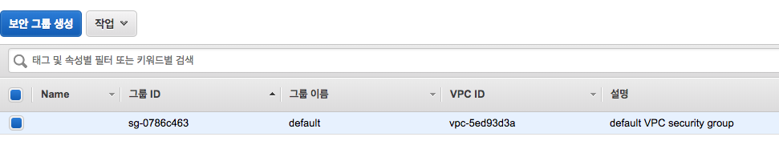
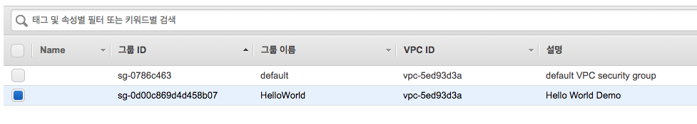
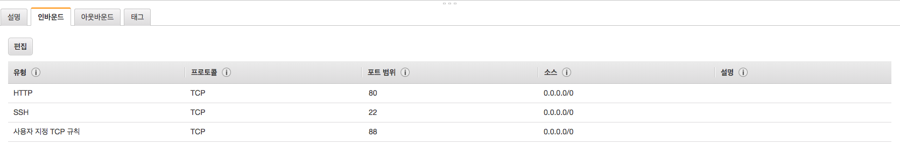

# AWS CLI examples

## AWS CLI 개요
- 사용자가 GUI 환경이 아닌 콘솔에서 CLI 명령어로 AWS의 기능을 제어할 수 있는 환경
- 일반적으로 클라우드 기반의 서버 환경을 구축할 때 가장 일반적으로 사용되고 있음

## 기본 명령어들

### S3
- S3 bucket list [reference](https://docs.aws.amazon.com/cli/latest/reference/s3/ls.html)
```bash
aws s3 ls  
aws s3 ls s3://teamlab-bucket
```

- S3 파일 업로드 하기 [reference](https://docs.aws.amazon.com/cli/latest/reference/s3/cp.html)
```bash
aws s3 cp [FILENAME] s3://teamlab-bucket/[FILENAME]
```

- S3 파일 삭제하기 [reference](https://docs.aws.amazon.com/cli/latest/reference/s3/rm.html)
```bash
aws s3 rm s3://teamlab-bucket/[FILENAME]
```

- S3 bucket 삭제하기 [reference](https://docs.aws.amazon.com/cli/latest/reference/s3/rb.html)
```bash
aws s3 rb s3://teamlab-bucket
```

### VPC
- 보안그룹의 기본 정보를 보기 위한 명령
```bash
aws ec2 describe-vpcs
```


- 보안그룹의 생성을 위한 명령어 [reference](https://docs.aws.amazon.com/cli/latest/reference/ec2/create-security-group.html)
```bash
aws ec2 create-security-group \
--group-name HelloWorld \
--description "Hello World Demo" \
--vpc-id YOUR_VPC_ID
```


- 보안그룹에 IN/OUT bound 설정하기 [reference](https://docs.aws.amazon.com/cli/latest/reference/ec2/authorize-security-group-ingress.html)
```bash
aws ec2 authorize-security-group-ingress \
  --group-name HelloWorld \
  --protocol tcp \
  --port 22 \
  --cidr 0.0.0.0/0
```


- 보안그룹 설정 정보 확인하기 [reference](https://docs.aws.amazon.com/cli/latest/reference/ec2/describe-security-groups.html)
```bash
aws ec2 describe-security-groups \
 --group-names HelloWorld \
 --output table
```

### SSH Key
- 사용가능한 SSH Key 새로 생성하기 [reference](https://docs.aws.amazon.com/cli/latest/reference/ec2/create-key-pair.html)
```bash
aws ec2 create-key-pair \
  --key-name AWS_Key_Test
```

- 생성된 키 값 저장하기
```bash
echo '<PASTE>' > ~/.ssh/aws_key_test.pem
chmod 600 ~/.ssh/aws_key_test.pem
```

- SSH Key 삭제하기 [reference](https://docs.aws.amazon.com/cli/latest/reference/ec2/delete-key-pair.html)
```bash
aws ec2 delete-key-pair \
  --key-name AWS_Key_Test
rm ~/.ssh/aws_key_test.pem
```

### EC2
- EC2 실행하기 [reference](https://docs.aws.amazon.com/cli/latest/reference/ec2/run-instances.html)
```bash
aws ec2 run-instances \
  --instance-type t2.micro \
  --key-name TestKey \
  --security-group-ids sg-0d00c869d4d458b07 \
  --image-id ami-03221428e6676db69
```

- EC2 종료하기 [reference](https://docs.aws.amazon.com/cli/latest/reference/ec2/stop-instances.html)
```bash
aws ec2 stop-instances \
  --instance-ids i-0f5382c1cea8eef3d
```

- EC2 삭제하기 [reference](https://docs.aws.amazon.com/cli/latest/reference/opsworks/delete-instance.html)
```bash
aws ec2 delete-instance \
  --instance-ids i-0f5382c1cea8eef3d
```
