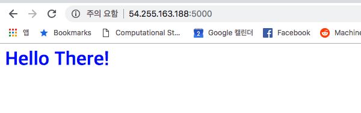
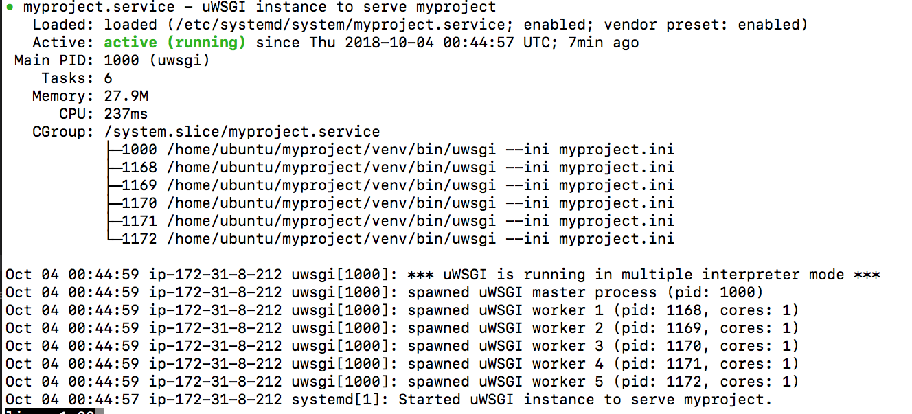

# Web Application Configuration

## 목적
실제 작동하는 간단한 웹 어플리케이션을 만들어 로그 데이터를 기록으로 남기고 관리하는 경험을 수행함. [reference](https://www.digitalocean.com/community/tutorials/how-to-set-up-django-with-postgres-nginx-and-gunicorn-on-ubuntu-14-04)

## 설치방법
### 1. EC2 설정 및 접속
```bash
python ec2_boto3_creation.py
```

### 2. Ubuntu 파이썬 업데이트 (python3.5 --> python3.6)
- [reference](http://ubuntuhandbook.org/index.php/2017/07/install-python-3-6-1-in-ubuntu-16-04-lts/)

- python3.6 설치
```bash
sudo add-apt-repository ppa:jonathonf/python-3.6
sudo apt-get update
sudo apt-get install python3.6
```

- python 우선순위 설정
```bash
sudo update-alternatives --install /usr/bin/python3 python3 /usr/bin/python3.5 1
sudo update-alternatives --install /usr/bin/python3 python3 /usr/bin/python3.6 2
sudo update-alternatives --config python3
```

- python3.6 설정 확인
```bash
python3 -V
```

### 3. Ubuntu 관련컴포넌트 설치
```bash
sudo apt-get update
sudo apt-get install python-pip python-dev nginx
sudo apt-get install python3.6-dev
sudo apt install python3-pip
```

### 4. 프로젝트 디렉토리 만들기
```bash
mkdir ~/myproject
cd ~/myproject
```

### 5. 가상환경 설치 및 만들기
```bash
pip3 install virtualenv
virtualenv venv --python=python3.6
source venv/bin/activate
```

### 6. flask 및 wsgi 설치
```bash
pip3 install uwsgi flask
```

### 7. flask 코드
```bash
vi ~/myproject/myproject.py
```

```python
from flask import Flask
app = Flask(__name__)

@app.route("/")
def hello():
    return "<h1 style='color:blue'>Hello There!</h1>"

if __name__ == "__main__":
    app.run(host='0.0.0.0')
```

### 8. flask 실행
- flaks 실행
```python
sudo ufw allow 5000
python myproject.py
```
- flaks 작동확인: http://your_server_ip:5000



### 9. Configuring uWSGI
- WSGI entry point 작성하기 - `wsgi.py`
```python
from myproject import app

if __name__ == "__main__":
    app.run()
```

- flaks 작동확인: http://your_server_ip:5000


-  uWSGI Configuration File - ~/myproject/myproject.ini
```bash
[uwsgi]
module = wsgi:app

master = true
processes = 5

socket = myproject.sock
chmod-socket = 660
vacuum = true

die-on-term = true
```

- system daemon 파일 만들기
```bash
sudo vi /etc/systemd/system/myproject.service
```
```bash
[Unit]
Description=uWSGI instance to serve myproject
After=network.target

[Service]
User=sammy
Group=www-data
WorkingDirectory=/home/ubuntu/myproject
Environment="PATH=/home/ubuntu/myproject/venv/bin"
ExecStart=/home/ubuntu/myproject/venv/bin/uwsgi --ini myproject.ini

[Install]
WantedBy=multi-user.target
```

- system daemon 동작하기
```bash
sudo systemctl start myproject
sudo systemctl enable myproject
sudo systemctl status myproject
```


-  Flask 세팅
```bash
sudo vi /etc/nginx/sites-available/myproject
```
```bash
server {
    listen 80;
    server_name your_domain www.your_domain;

    location / {
        include uwsgi_params;
        uwsgi_pass unix:/home/ubuntu/myproject/myproject.sock;
    }
}
```

-  Flask 재가동
```bash
sudo ln -s /etc/nginx/sites-available/myproject /etc/nginx/sites-enabled
sudo nginx -t
sudo systemctl restart nginx
sudo ufw delete allow 5000
sudo ufw allow 'Nginx Full'
```

- flaks 작동확인: http://your_server_ip:5000


- Access 로그 확인
```bash
vi /var/log/nginx/access.log
```
