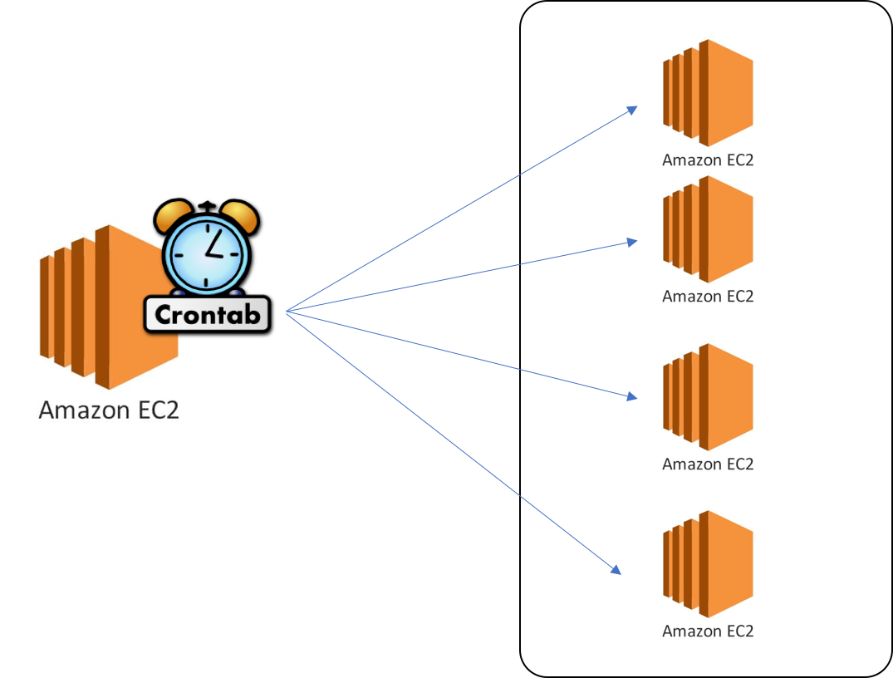

# crontab 만들기

## 개요
리눅스 시스템의 대표적인 스케줄러 도구인 크론텝을 활용하여 스케줄마다 발생하는 프로그램을 실행가능하게 한다.
>"특정 시간에 특정 작업을 해야한다."

## 작성방법
### 수정명령어
```bash
$ crontab -e
```

### 주기 결정
```bash
*　　　　　　*　　　　　　*　　　　　　*　　　　　　*
분(0-59)　　시간(0-23)　일(1-31)　　월(1-12)　　　요일(0-7)
```

###  사용예제
```bash
* * * * * /home/ubuntu/python helloword.py >> /home/ubuntu/test.log
```

```python
import datetime
print(datetime.datetime.now() + ": Hello, World")
```

### 사용방법



## References
- [리눅스 크론탭(Linux Crontab) 사용법bt JDM's Blog](https://jdm.kr/blog/2)
